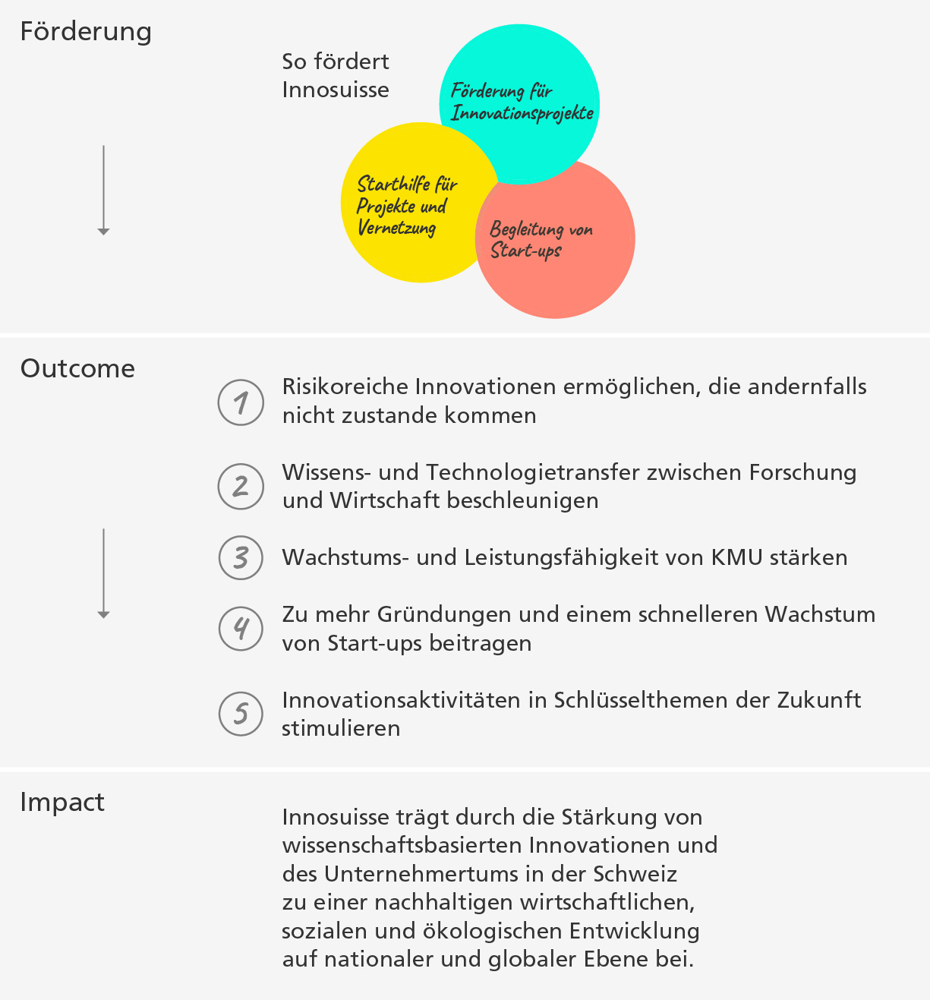

```js
import { html } from "npm:htl";
import { coloredUnderline, plot_erhebung} from "../functions.js"
```

## Methodische Grundlagen
### Konzeption des Wirkungsmonitorings

Nach einer Erarbeitung von konzeptionellen Grundlagen wurde 2021 das Wirkungsmonitoring bei den Umsetzungspartnern der Innovationsprojekte mit systematischen Befragungen eingeführt und seither kontinuierlich auf weitere Instrumente ausgedehnt. Die in den Grundlagen festgelegten Ziele der Wirkungsmessung sind erreicht worden und mittlerweile liegen eine Vielzahl aussagekräftiger Daten vor. Sie erlauben fundierte Aussagen zu den vielfältigen Wirkungen der Innovationsförderung zu formulieren.

Das Wirkungsmonitoring von Innosuisse basiert auf obligatorischen Befragungen und Vollerhebungen bei allen Umsetzungs- und Forschungspartnern der ${coloredUnderline("Innovationsprojekte","Förderung für Schweizer Innovationsprojekte")}, der KMU bei den ${coloredUnderline("Innovationsschecks","Innovationsscheck")} sowie bei allen am ${coloredUnderline("Core Coaching","Begleitung von Start-ups")} teilnehmenden Start-ups. Die Erhebungen erfolgen bei den Umsetzungspartnern der Innovationsprojekte und den Start-ups im Coaching jeweils beim Abschluss der Förderung und zusätzlich drei Jahre nach Abschluss. Bei den ${coloredUnderline("Innovation Booster","Starthilfe für Projekte und Vernetzung")} und den ${coloredUnderline("BRIDGE Proof of Concept-Projekten","BRIDGE: Proof of Concept")} beruhen die Ergebnisse auf Monitoring-Daten aller laufenden Initiativen. 

<div>${plot_erhebung()}</div>

### Details der Befragungen und Vollerhebungen
Bei den Befragungen und Selbsteinschätzungen der Fördernehmerinnen und Fördernehmer werden in der Regel Skalenbewertungen auf einer 6er-Skala (z.B. (1) keine Bedeutung, (2) geringe Bedeutung, (3) eher geringe Bedeutung, (4) eher hohe Bedeutung, (5) hohe Bedeutung, (6) sehr hohe Bedeutung verwendet). Dort wo sinnvoll, werden Ja-Nein-Fragen gestellt und ausgewählte Kennzahlen zu ökonomischen Kennzahlen erhoben.

Die Erhebungen sind so konzipiert, dass die Selbsteinschätzung der Fördernehmerinnen und Fördernehmer fokussiert ist auf die detaillierte Charakterisierung der Innovationsvorhaben und auf die direkte Wirkung der Förderung.

Die dargestellten Indikatoren basieren auf folgenden Datengrundlagen:

| Förderangebot                            | Datengrundlage                                         |
|----------------------------------|------------------------------------------------|
| Umsetzungspartner bei Innovationsprojekten | Mittelwert Berichtsjahre 2022–24           |
| Forschungspartner bei Innovationsprojekten | Berichtsjahr 2023–24                           |
| Start-up Core Coaching               | Mittelwert Berichtsjahre 2023–24         |
| Innovationsscheck               | Berichtsjahr 2023–24                              |
| BRIDGE Discovery         | Berichtsjahr 2024    |
| BRIDGE Proof of Concept         | Förderdaten und Abfragen im Handelsregister, Berichtsjahr 2023–24    |
| Innovation Booster              | Förderdaten und jährliche Befragungen der "Leading Houses", Berichtsjahr 2023–24 |               

Die Befragungen basieren auf differenzierten Bewertungen der befragten Zielgruppen und, dort wo vorhanden, auf Mittelwerten über mehrere Befragungsjahre. Die Bezugsjahre des Monitorings unterscheiden sich nach den einzelnen Förderangeboten und richten sich nach der Datenverfügbarkeit: 

Für die ${coloredUnderline("Innovationsprojekte","Förderung für Schweizer Innovationsprojekte")} bei den Umsetzungspartnern wird der Mittelwert über die drei aktuellsten Monitoringjahre dargestellt. Der Rücklauf der Befragungen liegt zwischen rund 50 % und über 75 % und erlaubt damit statistisch valide Aussagen. 

### Tabellarische Zusammenstellung der Ergebnisse

Die detaillierten Ergebnisse finden sich in einer tabellarischen Zusammenstellung ([⤓&nbsp;Excel](/_file/data//wirkungsindikatoren-2021-2023.xlsx)), gegliedert nach Instrumenten, Zielgruppen der Förderung, fünf Stossrichtungen der Wirkungsorientierung und differenzierter Kategorisierung der Wirkung
  
### Förderangebote und Wirkungsziele von Innosuisse (Outcomes)
Die Förderangebote von Innosuisse können in drei übergeordnete Förderbereiche gegliedert werden (vgl. nachfolgende Übersicht): 
1. ${coloredUnderline("Förderung für Innovationsprojekte","Förderung für Schweizer Innovationsprojekte")}
2. ${coloredUnderline("Starthilfe für Projekte und Vernetzung","Starthilfe für Projekte und Vernetzung")}
3. ${coloredUnderline("Begleitung von Start-ups","Begleitung von Start-ups")}.
  
Die nachfolgende Übersicht zeigt, zu welchen fünf Stossrichtungen (Outcomes) von Innosuisse die Förderangebote beitragen sollen. Die in der Folge dargestellten Ergebnisse der Befragungen sollen Aussagen machen über die Zielerreichung der Innovationsförderung und bieten eine fundierte Grundlage, um die Wirksamkeit der Fördermassnahmen zu beurteilen und diese gezielt weiterzuentwickeln.

<div class="card" style="width: 600px;">
  
</div>

Die Ergebnisse beinhalten einerseits kurz- bis mittelfristige Wirkungen bei Abschluss der Innovationsvorhaben oder kurz nach Projektabschluss. Andererseits werden auch längerfristige Wirkungen dargestellt, beispielsweise die Umsetzung auf dem Markt oder Beschäftigungswirkungen. 

Die Zuordnung zu den fünf dargestellten Stossrichtungen wird in der hier vorliegenden Berichterstattung nicht explizit dargestellt, wird aber in der tabellarischen Zusammenstellung (siehe oben) transparent gemacht. Dies gilt ebenso für die verwendeten Skalenbewertungen für die Berechnungen der ausgewiesenen Indikatoren. 

### Weiterentwicklung des Wirkungsmonitorings
Das vorliegende Wirkungsmonitoring wird schrittweise erweitert werden. Der Fokus bei der Weiterentwicklung liegt bei den ${coloredUnderline("Start-up Innovationsprojekten","Förderung für Schweizer Innovationsprojekte")}, den ${coloredUnderline("international geförderten Projekten", "Förderung für internationale Innovationsprojekte")}, der ${coloredUnderline("Flagship Initiative","Förderung für Schweizer Innovationsprojekte")} und dem mit dem Schweizerischen Nationalfonds (SNF) durchgeführten ${coloredUnderline("BRIDGE Proof of Concept","Förderung für Schweizer Innovationsprojekte")}. 

Für die in der vergangenen BFI-Periode 2021–2024 neu eingeführten Instrumente und zum Teil finanziell gewichtigen Instrumente (Flagship Initiative, Start-up Innovationsprojekte, Swiss Accelerator) liegen noch keine Daten vor, da die ersten Projekte erst im Berichtsjahr 2025 abgeschlossen werden. Die internationalen Projekte, die Start-up Innovationsprojekte und das BRIDGE Proof of Concept Programm werden ab Förderjahr 2026 in die Berichterstattung miteinbezogen, die übrigen Instrumente in den Folgejahren.