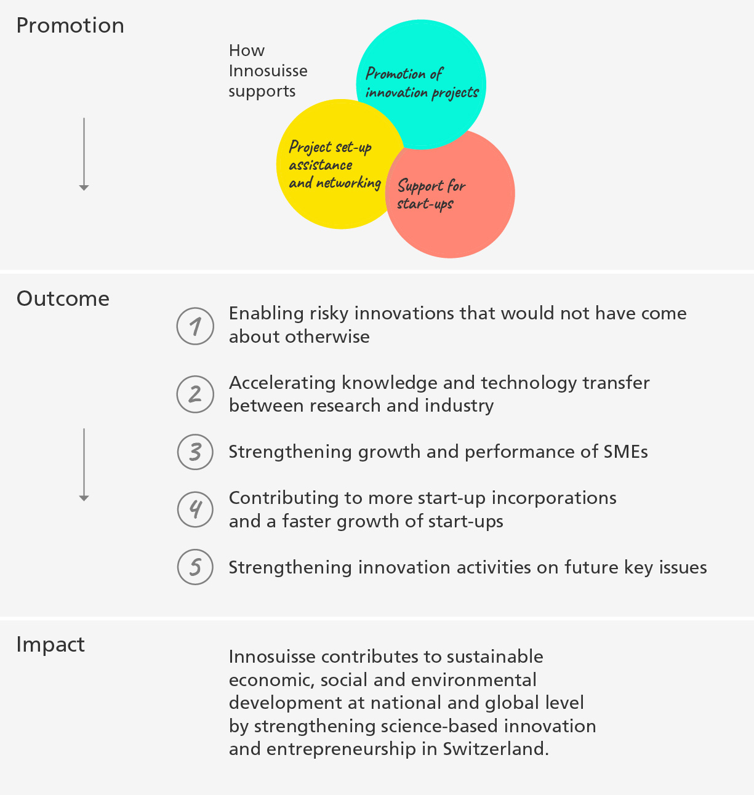

```js
import { html } from "npm:htl";
import { coloredUnderline, plot_erhebung} from "../functions.js"
```

## Methodology
### Conceptual foundation of the impact monitoring

After the conceptual foundations were developed, impact monitoring was introduced at the Innovation projects with implementation partners with systematic surveys in 2021 and has since been continuously expanded to include further instruments. The objectives of impact measurement set out in the principles have been achieved and a large amount of meaningful data is now available. They allow well-founded statements to be formulated about the diverse impacts of innovation promotion.

Innosuisse's impact monitoring is based on mandatory and exhaustive surveys of all implementation and research partners of the ${coloredUnderline("innovation projects","Förderung für Schweizer Innovationsprojekte")}, SMEs with ${coloredUnderline("Innovation cheques","Innovationsscheck")} and all start-ups participating in ${coloredUnderline("Core Coaching","Begleitung von Start-ups")}. The surveys of the implementation partners of the innovation projects and the start-ups in the coaching programme are carried out at the end of the funding period and again three years after completion. For the ${coloredUnderline("Innovation Boosters","Starthilfe für Projekte und Vernetzung")} and the ${coloredUnderline("BRIDGE Proof of Concept projects","BRIDGE: Proof of Concept")}, the results are based on monitoring data from all ongoing initiatives.

<div>${plot_erhebung()}</div>

### Details of the surveys
In the surveys and self-assessments of funding beneficiaries, scale ratings on a scale of 1 to 6 are generally used (e.g. (1) no significance, (2) low significance, (3) rather low significance, (4) rather high significance, (5) high significance, (6) very high significance). Where appropriate, yes/no questions are asked and selected economic indicators are collected.

The surveys are designed in such a way that the self-assessment of the funding beneficiaries is focused on the detailed characterisation of the innovation projects and on the direct impact of the funding.

The indicators presented are based on the following data:

| Support offer                           | Data basis / reporting year                                         |
|----------------------------------|------------------------------------------------|
| Implementation partners in innovation projects | Mean value for reporting years 2021–2023           |
| Innovation cheques               | Reporting year 2023                              |
| Research partners in innovation projects | Reporting year 2023                           |
| BRIDGE Proof of Concept         | Funding data and queries in the commercial register, reporting year 2023    |
| Innovation Booster              | Funding data and annual surveys of the ‘Leading Houses’, reporting year 2023 |
| Start-up Core Coaching               | Mean value for reporting years 2023 and 2024         |

The surveys are based on differentiated assessments of the surveyed target groups and, where available, on mean values over several survey years. The reference years for monitoring differ according to the individual support offers and depend on data availability:

For innovation projects with implementation partners, the mean value of the monitoring years 2021–2023 is shown. The results for start-ups in Core Coaching are based on the average of the monitoring years 2023 and 2024, as the evaluations for 2024 are already available. The other indicators are based on the monitoring year 2023.

The response rate to the surveys is between around 50% and over 75%, thus allowing statistically valid statements to be made.

### Table of the results

The detailed results can be found in a table ([⤓&nbsp;Excel](/_file/data//wirkungsindikatoren-2021-2023.xlsx), in German), broken down by instrument, funding target group, the five impact-oriented thrusts and a differentiated categorisation of the impact.
  
### Innosuisse funding offers and impact objectives (outcomes)
Innosuisse's funding offers can be divided into three overarching funding areas (see overview below):
1. ${coloredUnderline("Funding for innovation projects","Förderung für Schweizer Innovationsprojekte")}
2. ${coloredUnderline("Project set-up assistance and networking","Starthilfe für Projekte und Vernetzung")}
3. ${coloredUnderline("Support for start-ups","Begleitung von Start-ups")}
  
The following overview shows the five Innosuisse thrusts (outcomes) to which the support offers should contribute. The results of the surveys presented below are intended to provide information on the achievement of objectives in innovation promotion and offer a sound basis for assessing the effectiveness of the support measures and developing them in a targeted manner.

<div class="card" style="width: 600px;">
  
</div>

The results show short- to medium-term impacts at the end of the innovation project or shortly thereafter. They also show longer-term impacts, such as market implementation and employment effects.

The assignment to the five thrusts is not explicitly shown in this report, but is made transparent in the tabular summary (see above). This also applies to the scale ratings used to calculate the reported indicators.

### Further development of impact monitoring

This impact monitoring will be gradually expanded. The focus of the further development is on the ${coloredUnderline("Start-up innovation projects","Förderung für Schweizer Innovationsprojekte")}, the ${coloredUnderline("internationally funded projects", "Förderung für internationale Innovationsprojekte")}, the ${coloredUnderline("Flagship Initiative","Förderung für Schweizer Innovationsprojekte")} and the two funding lines of the ${coloredUnderline("BRIDGE programme","Förderung für Schweizer Innovationsprojekte")}, which is run jointly with the Swiss National Science Foundation (SNSF).

No data is yet available for the instruments introduced in the previous ERI period 2021–2024 and for some of the financially significant instruments (Flagship Initiative, Start-up innovation projects, Swiss Accelerator), as the first projects will not be completed until the 2025 reporting year. International projects and the BRIDGE programme will be included in the reporting from funding year 2025, and the other instruments from 2026 and subsequent years.

In the first half of 2025, the results and indicators presented here will be updated and communicated for funding year 2024.