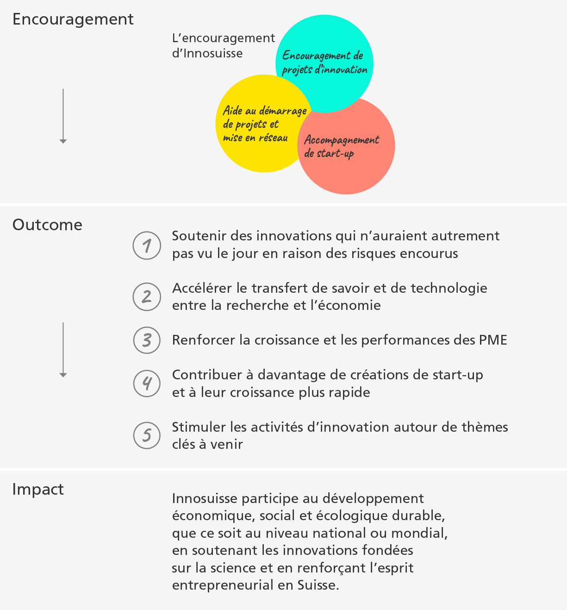

```js
import { html } from "npm:htl";
import { coloredUnderline, plot_erhebung} from "../functions.js"
```

## Bases méthodologiques
### Conception du suivi de l'impact

Après l'élaboration des bases conceptuelles, le suivi de l'impact a été introduit en 2021 auprès des partenaires chargés de la mise en valeur des projets d'innovation par le biais d'enquêtes systématiques, et a depuis été continuellement étendu à d'autres instruments. Les objectifs de mesure de l'impact définis dans les bases ont été atteints et un grand nombre de données significatives sont désormais disponibles. Ils permettent de formuler des déclarations fondées sur les multiples impacts de l'encouragement de l'innovation.

Le suivi de l'impact d'Innosuisse repose sur des enquêtes obligatoires et exhaustifs auprès de tous les partenaires chargés de la mise en valeur et de recherche des ${coloredUnderline("projets d'innovation","Förderung für Schweizer Innovationsprojekte")}, des PME bénéficiant des ${coloredUnderline("Chèques d'innovation","Innovationsscheck")} ainsi que de toutes les start-ups participant au ${coloredUnderline("Core Coaching","Begleitung von Start-ups")}. Les enquêtes sont menées auprès des partenaires chargés de la mise en valeur des projets d'innovation et des start-ups en coaching, à la fin de la période d'encouragement et trois ans après. Pour les ${coloredUnderline("Innovation Booster","Starthilfe für Projekte und Vernetzung")} et les projets ${coloredUnderline("BRIDGE Proof of Concept","BRIDGE: Proof of Concept")}, les résultats sont basés sur les données de suivi de toutes les initiatives en cours.

<div>${plot_erhebung()}</div>

### Détails des enquêtes
Dans les enquêtes et les auto-évaluations des bénéficiaires de l'encouragement, on utilise généralement des échelles de 6 points (par exemple (1) aucune importance, (2) importance faible, (3) importance plutôt faible, (4) importance plutôt élevée, (5) importance élevée, (6) importance très élevée). Lorsque cela s'avère pertinent, des questions fermées sont posées et certains indicateurs sont relevés pour obtenir des indicateurs économiques.

Les enquêtes sont conçues de manière à ce que l'auto-évaluation des bénéficiaires de l'encouragement se concentre sur la caractérisation détaillée des projets innovants et sur l'impact direct de l'encouragement.

Les indicateurs présentés sont basés sur les données suivantes :

| Offre d'encouragement                            | Base de données / année de référence                                         |
|----------------------------------|------------------------------------------------|
| Partenaires chargés de la mise en valeur dans les projets d'innovation | Moyenne des années de référence 2021–2023           |
| Chèques d'innovation               | Année de référence 2023                              |
| Partenaires de recherche dans les projets d'innovation | Année de référence 2023                           |
| BRIDGE Proof of Concept         | Données de financement et consultations du registre du commerce, année de référence 2023    |
| Innovation Booster              | Données d'encouragement et enquêtes annuelles auprès des « Leading Houses », année de référence 2023 |
| Start-up Core Coaching               | Moyenne des années de référence 2023 et 2024         |   

Les enquêtes se basent sur des évaluations différenciées des groupes cibles interrogés et, le cas échéant, sur des valeurs moyennes sur plusieurs années d'enquête. Les années de référence du suivi diffèrent selon les offres d'encouragement individuelles et dépendent de la disponibilité des données :

Pour les ${coloredUnderline("projets d'innovation des partenaires chargés de la mise en valeur","Förderung für Schweizer Innovationsprojekte")}, la moyenne des années de suivi 2021-2023 est présentée. Les résultats des start-ups dans le ${coloredUnderline("Core Coaching","Begleitung von Start-ups")} sont basés sur la moyenne des années de suivi 2023 et 2024, car les évaluations pour 2024 sont déjà disponibles. Les autres indicateurs sont basés sur l'année de suivi 2023.

Le taux de réponse aux enquêtes se situe entre environ 50 % et plus de 75 %, ce qui permet de tirer des conclusions statistiquement valables.

### Tableau récapitulatif des résultats

Les résultats détaillés sont présentés sous forme de tableau ([⤓&nbsp;Excel](/_file/data//wirkungsindikatoren-2021-2023.xlsx), en allemand), classés par instruments, groupes cibles de l'encouragement, cinq orientations vers l'impact et catégorisation différenciée de l'impact.
  
### Offres d'encouragement et objectifs d'impact d'Innosuisse (outcomes)
Les offres d'encouragement d'Innosuisse peuvent être classées en trois domaines d'encouragement principaux (voir l'illustration ci-dessous) :
1. ${coloredUnderline("Encouragement de projets d'innovation","Förderung für Schweizer Innovationsprojekte")}
2. ${coloredUnderline("Aide au démarrage de projets et mise en réseau","Starthilfe für Projekte und Vernetzung")}
3. ${coloredUnderline("Accompagnement de start-up","Begleitung von Start-ups")}
  
Le tableau ci-dessous montre les cinq orientations (outcomes) d'Innosuisse auxquelles les offres d'encouragement doivent contribuer. Les résultats des enquêtes présentés ci-après visent à fournir des informations sur l'atteinte des objectifs de l'encouragement de l'innovation et à offrir une base solide pour évaluer l'efficacité des mesures d'encouragement et les développer de manière ciblée.

<div class="card" style="width: 600px;">
  
</div>

Les résultats comprennent d'une part les impacts à court et moyen terme à la fin des projets innovants ou peu après la fin du projet. D'autre part, les impacts à plus long terme sont également présentés, par exemple la mise en œuvre sur le marché ou les effets sur l'emploi.

L'attribution aux cinq axes présentés n'est pas explicitée dans le présent rapport, mais elle est rendue transparente dans le tableau récapitulatif (voir ci-dessus). Il en va de même pour les échelles utilisées pour le calcul des indicateurs présentés.

### Développement du suivi de l'impact

Le présent suivi de l'impact sera progressivement étendu. L'accent sera mis sur les ${coloredUnderline("projets d'innovation pour start-up","Förderung für Schweizer Innovationsprojekte")}, les ${coloredUnderline("projets soutenus au niveau international", "Förderung für internationale Innovationsprojekte")}, l'${coloredUnderline("Initiative Flagship","Förderung für Schweizer Innovationsprojekte")} et les deux lignes de financement du ${coloredUnderline("programme BRIDGE","Förderung für Schweizer Innovationsprojekte")}, mis en œuvre conjointement avec le Fonds national suisse (FNS).

Aucune donnée n'est encore disponible pour les instruments nouvellement introduits au cours de la période FRI 2021-2024 et pour certains instruments importants sur le plan financier (Initiative Flagship, Projets d'innovation pour start-up, Swiss Accelerator), car les premiers projets ne seront achevés qu'en 2025. Les projets internationaux et le programme BRIDGE seront inclus dans le rapport à partir de l'année de financement 2025, les autres instruments à partir de 2026 et des années suivantes.

Au cours du premier semestre 2025, les résultats et indicateurs présentés ici seront mis à jour et communiqués pour l'année de financement 2024.